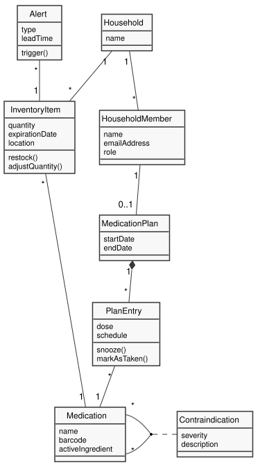
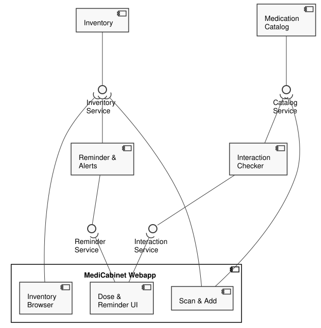
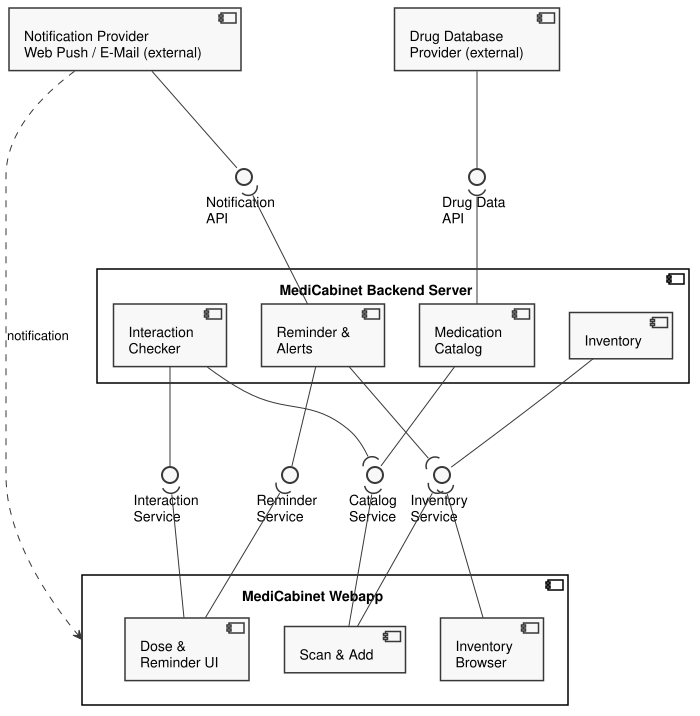

# MediCabinet

# MediCabinet — A Drug Inventory Tracker

## Problem Statement

In many households — especially those with elderly relatives, chronic conditions, or shared caregiving — medications quickly turn into a chaotic mess. Painkillers, prescriptions, vitamins, and over-the-counter remedies pile up across kitchen cabinets, bedside drawers, and travel bags. Half of them are nearly empty, some have expired without anyone noticing, and a few should never have been taken together in the first place. The consequences of losing track range from the merely annoying — a missed dose, a late-night drive to the pharmacy — to genuinely dangerous: an expired antibiotic taken in good faith, a forgotten contraindication between two innocent-looking pills, or an accidental double-dose during a confusing morning.
We want to build an application — working title MediCabinet — that brings order to this. The application should help users maintain an accurate, up-to-date inventory of every medication in their home, with quantities, dosage instructions, and expiration dates always at their fingertips. Adding a new medication should be effortless: scanning the packaging barcode, taking a photo of the box, or typing it in by hand. Searching and filtering the inventory should feel as natural as searching contacts on a phone. When something is about to expire or run low, the app should warn the user with enough advance notice to restock without panic. When two medications shouldn't be combined, the app should make that visible before the next dose, not after.

**Scope of v1:** single household, no login or caregiver sharing (access management is deferred), web app only.

## Analysis

The Analysis Object Model captures the problem domain. Key decisions: **Medication** (the abstract drug — name, barcode, active ingredient) is separate from **InventoryItem** (the concrete package at home — quantity, expiry, location). **Contraindication** is an association class between two Medications. Every household member can have a **MedicationPlan** consisting of **PlanEntries** (dose + schedule per medication) — the personal dose lives in the plan, not on the drug.

## Component Architecture

The system is decomposed into four backend subsystems, each offering exactly one service, and a webapp consuming them. The Interaction Checker uses the Catalog Service for contraindication data; Reminder & Alerts reads the inventory to detect upcoming expiry and low stock. This keeps coupling low (the webapp only talks to services) and cohesion high (everything about stock levels lives in Inventory).

| Component | Responsibility |
|-----------|----------------|
| Inventory | Manages the household's inventory items: quantities, expiry dates, locations |
| Medication Catalog | Drug master data: barcode lookup, ingredients, contraindication data (adapter to an external provider) |
| Interaction Checker | Checks a planned dose against the inventory/plan for dangerous combinations |
| Reminder & Alerts | Medication plans, dose reminders, expiry and low-stock alerts |
| MediCabinet Webapp | UI: scan & add, browse/search inventory, dose & reminder interaction |

## Deployment

Adapting to the design goals (client-server, replaceable external providers, safety checks in one place server-side): all backend components are deployed together on a single **MediCabinet Backend Server** — a modular monolith, adequate for the team size and avoiding microservice overhead. The webapp runs in the user's browser. Two external systems are attached behind our own components, so each provider can be swapped without touching the rest: the **Drug Database Provider** (consumed only by the Medication Catalog) and a **Notification Provider** (Web Push / e-mail, consumed only by Reminder & Alerts).

